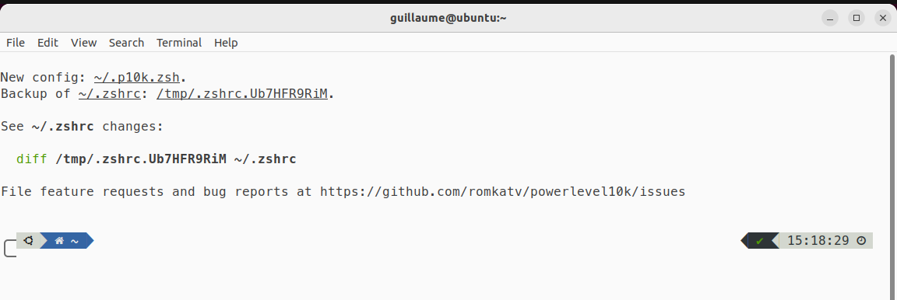
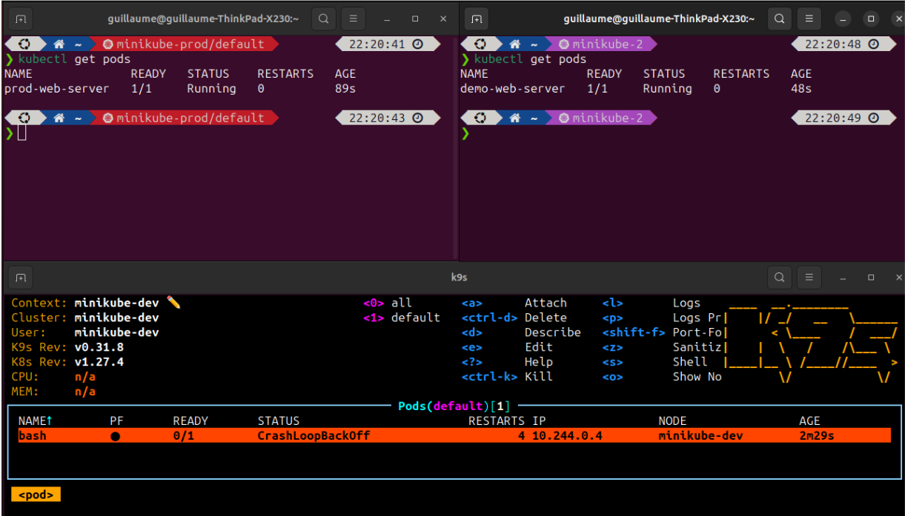

# LINUX

We will use:

* `zsh` which is a modern shell
* `Ho My ZSH` which is a framework for managing your Zsh configuration
* `PowerLevel10k` which is a powerfull theme engine
* and of course `Kubeswitch`

## Install zsh

Simply install `zsh` using your distribution's package manager.
For example for ubuntu

```bash
sudo apt install zsh
```

You can get more info about the installation process here: <https://github.com/ohmyzsh/ohmyzsh/wiki/Installing-ZSH>

## Make zsh your default shell

On most distributions, you should be able to use the `chsh` tool to make zsh your default shell.

```bash
chsh -s $(which zsh)
```

If the chsh command isn't available on your system, you can simply edit the `/etc/passwd` file and change `/bin/bash` to `/usr/bin/zsh` on your user's line. You need root permissions to do that.

Then you will need to logout from your session and login again.

Then open a new shell, it should open zsh.
As you don't have a `~/.zshrc` file, zsh will ask you a few questions to create one. I suggest to answer option 2 to get a default configuration. `(2)  Populate your ~/.zshrc with the configuration recommended`

You can double check your are using zsh by running

```zsh
echo $SHELL
```

## Install and configure Ho My ZSH

First, ensure that `curl` and `git` are installed using your distribution's package manager.
For example on Ubuntu

```zsh
sudo apt install curl git
```

Now, you can run this curl command to download and run the Ho My ZSH install script

```zsh
sh -c "$(curl -fsSL https://raw.githubusercontent.com/ohmyzsh/ohmyzsh/master/tools/install.sh)"
```

## Install PowerLevel10k theme for Ho My ZSH

### Install the recommanded font

First, install the recommended font for PowerLevel10k.
Download these four ttf files, and install them. On most systems, you just need to double click the files and click install. If it's not the case, refer to your OS documentation.

* [MesloLGS NF Regular.ttf](
   https://github.com/romkatv/powerlevel10k-media/raw/master/MesloLGS%20NF%20Regular.ttf)
* [MesloLGS NF Bold.ttf](
   https://github.com/romkatv/powerlevel10k-media/raw/master/MesloLGS%20NF%20Bold.ttf)
* [MesloLGS NF Italic.ttf](
   https://github.com/romkatv/powerlevel10k-media/raw/master/MesloLGS%20NF%20Italic.ttf)
* [MesloLGS NF Bold Italic.ttf](
   https://github.com/romkatv/powerlevel10k-media/raw/master/MesloLGS%20NF%20Bold%20Italic.ttf)

You then need to tell your terminal to use it. It is usually straightforward, just go in your terminal preferences and set the font. If you can't find it, PowerLevel10k documentation provides instructions for a lot of terminals:
<https://github.com/romkatv/powerlevel10k?tab=readme-ov-file#fonts>

### Install Powerlevel10k

Simply run this git command to download it, and this echo command to configure your `~/.zshrc`

```zsh
git clone --depth=1 https://github.com/romkatv/powerlevel10k.git ~/powerlevel10k
echo 'source ~/powerlevel10k/powerlevel10k.zsh-theme' >>~/.zshrc
```

### Run the first configuration wizard

You can now close you terminal and open a new one. The configuration Wizard for PowerLevel10k will run, as you don't have a config file for it yet.

The wizard will show you come special characters and ask you if they are displayed correctly.
The special characters should display correctly. If not, it means that the fonts are not installed or configured correctly.
Simply answer the other questions to best suit your needs.

After answering all the questions, you should have a nice shell!


If you want to run the wizard again, run this command. **Be careful, it will overwrite your further customizations** (but it keeps a backup)

```zsh
p10k configure
```

### Further customise your p10k profile to always display the kubernetes context

By default, the kubectl context will be displayed only when we run some commands. We want to always display it.

First, open `~/.p10k.zsh` with a text editor.

To always display the kubectl context, find the line containing `POWERLEVEL9K_KUBECONTEXT_SHOW_ON_COMMAND` and comment it.

You may also want to move the kubecontext form the right of the shell to the left of the shell.
If so, move the `kubecontext` line from `POWERLEVEL9K_RIGHT_PROMPT_ELEMENTS` to `POWERLEVEL9K_LEFT_PROMPT_ELEMENTS`

You may also want to display the context in different colors depending if it is a prod cluster of a dev cluster. To do taht, look for `POWERLEVEL9K_KUBECONTEXT_CLASSES` and read the comments to create a new kubecontext class and assign new colors to different classes.

For example, here is a sample config:

```zsh
typeset -g POWERLEVEL9K_KUBECONTEXT_CLASSES=(
   '*prod*'  PROD    # These values are examples that are unlikely
   '*dev*'   DEV     # to match your needs. Customize them as needed.
   '*'       DEFAULT)
typeset -g POWERLEVEL9K_KUBECONTEXT_DEFAULT_FOREGROUND=7
typeset -g POWERLEVEL9K_KUBECONTEXT_DEFAULT_BACKGROUND=5
typeset -g POWERLEVEL9K_KUBECONTEXT_PROD_BACKGROUND=1
typeset -g POWERLEVEL9K_KUBECONTEXT_DEV_BACKGROUND=2
```

The numbered colors go from 0 to 255. The first 16 depends on your terminal theme. You can display then using the `neofetch` command.
The other are here: <https://upload.wikimedia.org/wikipedia/commons/1/15/Xterm_256color_chart.svg>

## Install and configure Kubeswitch

Now that you have a nice terminal, you can install kubeswitch.

Run these commands to download and install it. Change the version number according to the latest release.

```zsh
sudo curl -L -o /usr/local/bin/switcher https://github.com/danielfoehrKn/kubeswitch/releases/download/0.8.1/switcher_linux_amd64
sudo chmod +x /usr/local/bin/switcher
```

Kubeswitch needs a helper function in your `~/.zshrc`. It's able to create it automaticaly. You can also enable autocomplete and create a `s` alias command. Simply run this.

```zsh
echo 'source <(switcher init zsh)' >> ~/.zshrc

# optionally use alias `s` instead of `switch`
echo 'alias s=switch' >> ~/.zshrc

# Add autocompletion
echo 'source <(compdef _switcher switch)' >> ~/.zshrc
```

You can now run the `switch` or `s` command to run kubeswitch. **Don't call `switcher` directly, you need to call the `switch` zsh function to allow it to manipulate your environment variables.**

Run `switch -h` to display the help and learn about all the features.

### Use several config files with kubeswitch

You can create a config file for kubeswitch in the `~\.kube` folder.
You need to name the file `switch-config.yaml`

Here is a very simple example of a `switch-config.yaml` file.
This file will allow kubeswitch to parse all the `*.config` files from the `~/.kube/kubeconfigs/` folder and subfolders + the kubeconfig file in the `.kube` directory if its name matches the pattern `*config*`.

```yaml
kind: SwitchConfig
version: v1alpha1
kubeconfigName: "*config*"
kubeconfigStores:
- kind: filesystem
  kubeconfigName: "*.config"
  paths:
  - ~/.kube/kubeconfigs/
```

For more advanced configurations, refer to the official documentation: <https://github.com/danielfoehrKn/kubeswitch/blob/master/docs/kubeconfig_stores.md>

## Add more power to your zsh shell: autosuggestions, autocomplete and k9s

I advise to further explore the documentation of Powerlevel10k to take a look at the different things you can do with it: <https://github.com/romkatv/powerlevel10k>

You'll also probably want to install some plugins for Ho My Zsh:

* zsh-autosuggestions, here are the official installation instructions:
<https://github.com/zsh-users/zsh-autosuggestions/blob/master/INSTALL.md#oh-my-zsh>
* zsh-syntax-highlighting: <https://github.com/zsh-users/zsh-syntax-highlighting/blob/master/INSTALL.md#oh-my-zsh>

You can also install `k9s` wich is a terminal based UI to interact with your Kubernetes clusters <https://k9scli.io/>
You need to download the binary file from gitub and put it in `/usr/local/bin/` manually.

You may want `kubens` to easily switch namespaces: <https://github.com/ahmetb/kubectx/tree/master>

```zsh
sudo git clone https://github.com/ahmetb/kubectx /opt/kubectx
sudo ln -s /opt/kubectx/kubectx /usr/local/bin/kubectx
sudo ln -s /opt/kubectx/kubens /usr/local/bin/kubens
```

And why not add `fzf` for fuzzy search in your history or files: <https://github.com/junegunn/fzf>

```zsh
git clone --depth 1 https://github.com/junegunn/fzf.git ~/.fzf
~/.fzf/install
```


