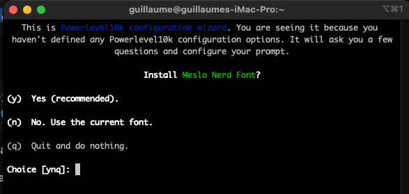

# MacOS

The instruction for MacOs are very similar to those for Linux, except for installation commands.

We will use:

* `zsh` which is a modern shell
* `iTerm2` which is a modern terminal emulator
* `Ho My ZSH` which is a framework for managing your Zsh configuration
* `PowerLevel10k` which is a powerfull theme engine
* and of course `Kubeswitch`

## Install homebrew

First we need to install homebrew and the `brew` command. this will be used to install most of the tools we need.

```zsh
/bin/bash -c "$(curl -fsSL https://raw.githubusercontent.com/Homebrew/install/HEAD/install.sh)"
```

At the end of the installation process, it may ask you to run some commands to add the `brew` binary to your `PATH`.

```zsh
(echo; echo 'eval "$(/opt/homebrew/bin/brew shellenv)"') >> /Users/demo/.zprofile
eval "$(/opt/homebrew/bin/brew shellenv)"
```

## Optionnal: upgrade ZSH

MacOS comes with zsh, but depending on the macOS version it can be an old version and you may want to update it. You can do it using brew.

`brew install zsh`

Then edit the `/etc/shells` file to add the new zsh version to authorized shells

```zsh
sudo vim /etc/shells
```

And add the folowing line at the end of the file

```zsh
/usr/local/bin/zsh
```

Then change the default shell for your user uning the following command

```zsh
chsh -s /usr/local/bin/zsh
```

## Optionnal: Install iterm2

The MacOS terminal doesn't have a lot of features. You should install a more modern terminal emulator.

I suggest to use iTerm2, but if you prefer another terminal, you can of course use it.

iTerm2 is a replacement for the macOS Terminal. It's more modern, has tabs, can split the terminal horizontally or vertically.
It also allow for the automatic font installation when we will install our zsh theme.

Install it using brew.

```zsh
brew install --cask iterm2
```

Then, close your terminal and run `iTerm`.

## Ensure you have kubectl installed

If you don't have kubectl installed, you can install it using brew.

```zsh
brew install kubernetes-cli
```

## Install ho my zsh

Ho My Zsh is not yet available with brew.
Run the following command to install it

```zsh
sh -c "$(curl -fsSL https://raw.githubusercontent.com/ohmyzsh/ohmyzsh/master/tools/install.sh)"
```

## Install PowerLevel10k theme for Ho My ZSH

### Install the recommanded font

If you use iTerm2, the font installation will be automatic during the setup wizard. If you don't use it, follow the instructions here: <https://github.com/romkatv/powerlevel10k?tab=readme-ov-file#manual-font-installation>

### Install Powerlevel10k

Install Powerlevel10k using brew, then run the echo command to add it to your `~/.zshrc`

```zsh
brew install powerlevel10k
echo "source $(brew --prefix)/share/powerlevel10k/powerlevel10k.zsh-theme" >>~/.zshrc
```

### Run the first configuration wizard

You can now close you terminal and open a new one. The configuration Wizard for PowerLevel10k will run, as you don't have a config file for it yet.

If you use iTerm2, the wizard will ask you to install the recommended font, say yes, then restart your terminal when asked to.



Then the wizard will show you come special characters and ask you if they are displayed correctly.
The special characters should display correctly. If not, it means that the fonts are not installed or configured correctly.
Simply answer the other questions to best suit your needs.

After answering all the questions, you should have a nice shell!


If you want to run the wizard again, run this command. **Be careful, it will overwrite your further customizations** (but it keeps a backup)

```zsh
p10k configure
```

### Further customise your p10k profile to always display the kubernetes context

By default, the kubectl context will be displayed only when we run some commands. We want to always display it.

First, open `~/.p10k.zsh` with a text editor.

To always display the kubectl context, find the line containing `POWERLEVEL9K_KUBECONTEXT_SHOW_ON_COMMAND` and comment it.

You may also want to move the kubecontext form the right of the shell to the left of the shell.
If so, move the `kubecontext` line from `POWERLEVEL9K_RIGHT_PROMPT_ELEMENTS` to `POWERLEVEL9K_LEFT_PROMPT_ELEMENTS`

You may also want to display the context in different colors depending if it is a prod cluster of a dev cluster. To do taht, look for `POWERLEVEL9K_KUBECONTEXT_CLASSES` and read the comments to create a new kubecontext class and assign new colors to different classes.

For example, here is a sample config:

```zsh
typeset -g POWERLEVEL9K_KUBECONTEXT_CLASSES=(
   '*prod*'  PROD    # These values are examples that are unlikely
   '*dev*'   DEV     # to match your needs. Customize them as needed.
   '*'       DEFAULT)
typeset -g POWERLEVEL9K_KUBECONTEXT_DEFAULT_FOREGROUND=7
typeset -g POWERLEVEL9K_KUBECONTEXT_DEFAULT_BACKGROUND=5
typeset -g POWERLEVEL9K_KUBECONTEXT_PROD_BACKGROUND=1
typeset -g POWERLEVEL9K_KUBECONTEXT_DEV_BACKGROUND=2
```

The numbered colors go from 0 to 255. The first 16 depends on your terminal theme. You can display then using the `neofetch` command. Install it by running `brew install neofetch` if needed.
The other colors are here: <https://upload.wikimedia.org/wikipedia/commons/1/15/Xterm_256color_chart.svg>

## Install kubeswitch

Now that you have a nice terminal, you can install kubeswitch using brew.

```zsh
brew install danielfoehrkn/switch/switch
```

Kubeswitch needs a helper function in your `~/.zshrc`. It's able to create it automaticaly. You can also enable autocomplete and create a `s` alias command. Simply run this.

```zsh
echo 'source <(switcher init zsh)' >> ~/.zshrc

# optionally use alias `s` instead of `switch`
echo 'alias s=switch' >> ~/.zshrc

# Add autocompletion
echo 'source <(compdef _switcher switch)' >> ~/.zshrc
```

You can now run the `switch` or `s` command to run kubeswitch. **Don't call `switcher` directly, you need to call the `switch` zsh function to allow it to manipulate your environment variables.**

Run `switch -h` to display the help and learn about all the features.

### Use several config files with kubeswitch

You can create a config file for kubeswitch in the `~\.kube` folder.
You need to name the file `switch-config.yaml`

Here is a very simple example of a `switch-config.yaml` file.
This file will allow kubeswitch to parse all the `*.config` files from the `~/.kube/kubeconfigs/` folder and subfolders + the kubeconfig file in the `.kube` directory if its name matches the pattern `*config*`.

```yaml
kind: SwitchConfig
version: v1alpha1
kubeconfigName: "*config*"
kubeconfigStores:
- kind: filesystem
  kubeconfigName: "*.config"
  paths:
  - ~/.kube/kubeconfigs/
```

For more advanced configurations, refer to the official documentation: <https://github.com/danielfoehrKn/kubeswitch/blob/master/docs/kubeconfig_stores.md>

## More tools

I advise to further explore the documentation of Powerlevel10k to take a look at the different things you can do with it: <https://github.com/romkatv/powerlevel10k>

You'll also probably want to install some plugins for Ho My Zsh:

* zsh-autosuggestions, here are the official installation instructions:
<https://github.com/zsh-users/zsh-autosuggestions/blob/master/INSTALL.md#oh-my-zsh>
* zsh-syntax-highlighting: <https://github.com/zsh-users/zsh-syntax-highlighting/blob/master/INSTALL.md#oh-my-zsh>

You can also install `k9s` wich is a terminal based UI to interact with your Kubernetes clusters <https://k9scli.io/>

You may want `kubens` to easily switch namespaces: <https://github.com/ahmetb/kubectx/tree/master>

And why not add `fzf` for fuzzy search in your history or files: <https://github.com/junegunn/fzf>

```zsh
# kubens is part of the kubectx package
brew install kubectx

brew install k9s

brew install fzf
# To install useful key bindings and fuzzy completion:
$(brew --prefix)/opt/fzf/install
```


