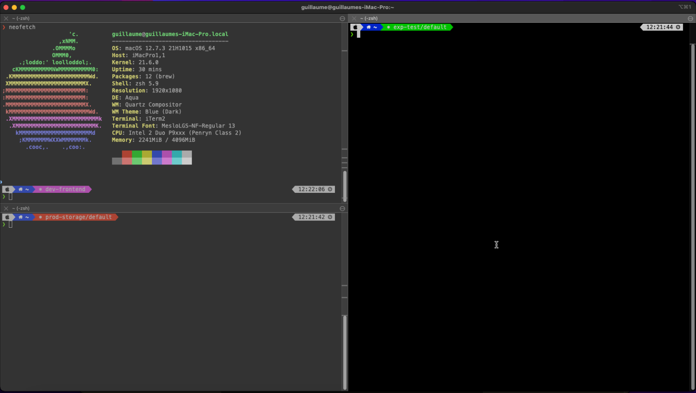
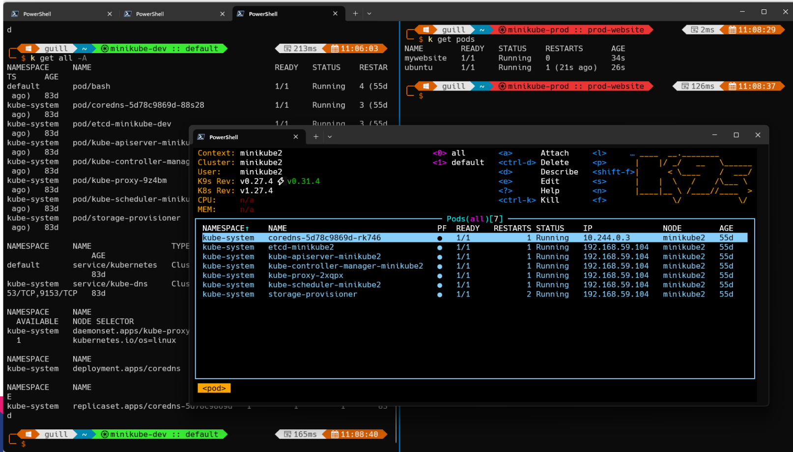

# Supercharge your CLI for Kubernetes

A collection of config files and script to go with the following presentation:
(add link here)

The goal is to customize our shell to work efficiently with a large number of Kubernetes clusters using [Kubeswitch](https://github.com/danielfoehrKn/kubeswitch).

Kubeswitch allows you to have a different kubectl context for each terminal windows, which is really usefull when working with a lot of different kubernetes clusters. You can open a new terminal to solve a production problem while keeping you other terminal in the context of the test you were running.

It does that by creating temp kubeconfig files and changing local environment variables to point to this config file.

It also allows you to use several kubeconfig files, organize them in folders, easily switch between context and more.

As a side effect, you need to display the current kubecontext in your shell if you don't want to get confused and run commands on production while you thought you were on your test cluster!

It's available for Linux and Mac.
FGtech provides a [Windows version of Kubeswitch](https://github.com/Les-filles-et-les-garcons-de-la-tech/kubeswitch). A [Pull Request is openned on the main project](https://github.com/danielfoehrKn/kubeswitch/pull/110), but wasn't approved yet when I wrote these lines.

## Linux

If you are using Linux, follow the [instructions for Linux](Linux/README.md)

## MacOS

If you are using MacOs, follow the [instructions for MacOs](Macos/README.md)

## Windows

If you are using windows, follow the [instructions for Windows](windows/README.md)

## Contribute to this repository

Issues and pull requests are welcome!
