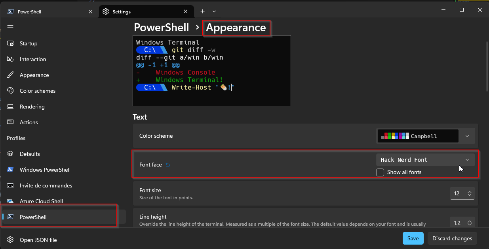
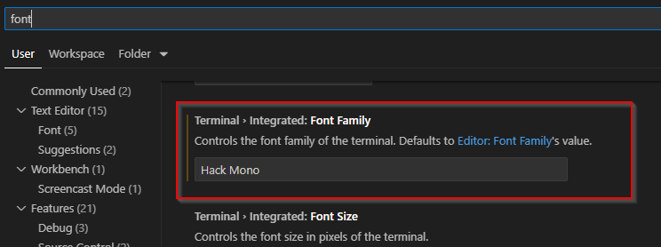
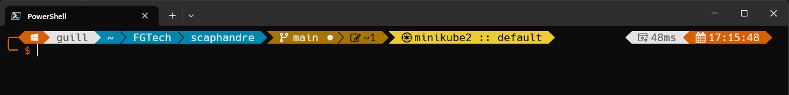
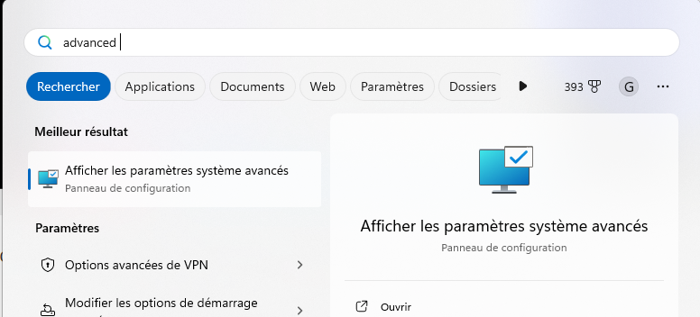
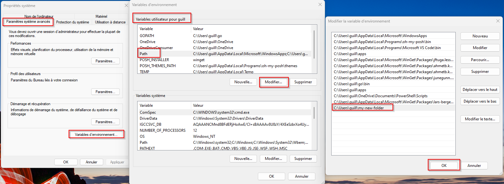

# Windows

* `powershell` version 7 which is a modern version
* `Windows Terminal` which is a modern terminal from Microsoft
* `Ho My Posh` which is is a powerfull theme engine for powershell 7
* and of course `Kubeswitch`

## Prerequisite

* Running a recent version of Windows, preferably the latest version of Windows 10 or Windows 11
* Having the `winget` command to download and install packages. This is included by default in Windows 11. For Windows 10, you can [install it from the Microsoft store](https://www.microsoft.com/p/app-installer/9nblggh4nns1#activetab=pivot:overviewtab) or follow [these instructions from Microsoft](https://learn.microsoft.com/en-us/windows/package-manager/winget/).

## Install PowerShell 7

Powershell 7 is the most recent powershell version as I write these lines. More info about it on their Github: <https://github.com/PowerShell/PowerShell>

If you don't already have it, you can easily install it using winget by running this command.

```powershell
winget install --id Microsoft.Powershell --source winget
```

## Install Windows Terminal

Windows Terminal allows a modern terminal experience on Windows, allowing you to split your terminal, to have several tabs, etc.
More info about it on their Github: <https://github.com/microsoft/terminal>

If you don't already have it, you can easily install it using winget by running this command.

```powershell
winget install --id Microsoft.WindowsTerminal -e
```

## Install Kubectl

If you don't already have kubectl available in your path, you can install it using winget.

```powershell
winget install --id Kubernetes.kubectl -e
```

## Using Ho My Posh to have a nice looking shell with usefull information

We will first install the Ho My Posh shell theme engine, and choose a nice theme that will provide us all the information we need, especially the current kubectl context.

### First, we need a Nerd Font

Nerd fonts add a lot of new characters like the Windows logo, the git icons, the kubernetes logo, etc. Choose one here: <https://www.nerdfonts.com/font-downloads>

I personally like the "Hack Nerd Font". Simply donwload it, unzip it, and right click and choose `install` on all the `.ttf` files.

Then open your Windows Terminal settings, and change the font in `Powershell > Appearance > Font face`



If you use the integrated terminal in vscode, you need to also change the font in vscode



### Then, we need Ho My Posh

Install Ho My Posh with winget

```powershell
winget install JanDeDobbeleer.OhMyPosh -s winget
```

Then, you will need to choose a theme. You can take a look at all the provided theme here: <https://ohmyposh.dev/docs/themes>

Most of them don't include the kubectl context, but fortunately you can customize them easily.

I also provide the quick-term-kube-colors theme, a customized version of the "quick-term" theme which include what we need.
You can get it [here](Ho_my_posh/quick-term-kube-colors.omp.json)
You need to put the file in your theme folder here: `%LOCALAPPDATA%\Programs\oh-my-posh\themes\`

Then you will need to edit your `$PROFILE` file to load Ho My Posh on shell startup.

```powershell
notepad $PROFILE
```

You will need to put a line like this one. You can direcly copy it if you use quick-term-kube-colors, you can copy it as it is. If you can to use another theme, or a theme you created, just change the theme file name.

```powershell
oh-my-posh init pwsh --config "$env:LOCALAPPDATA\Programs\oh-my-posh\themes\quick-term-kube-colors.omp.json" | Invoke-Expression
```

Now you should have a nice looking shell like this one


## Install kubeswitch

### Create a folder available in your `$PATH`

If you don't already have a folder available in your `$PATH` to put the kubeswitch binaries, create one.

Simply create a folder, for example named `app` and add it to your `$PATH`

In the start menu, search for "advanced" and click "Advanced system settings"



Then on the "advanced system parameters tab" click the "environment variables" button at the bottom.
On the "User variables" part (on top), find the "Path" variable and click "edit".
Add a new line with you new folder and click "OK". You will then need to restart your terminal to take this new path into account.



### Get kubeswitch

FGtech provides a [Windows version of Kubeswitch](https://github.com/Les-filles-et-les-garcons-de-la-tech/kubeswitch). A [Pull Request is openned on the main project](https://github.com/danielfoehrKn/kubeswitch/pull/110), but wasn't approved yet when I wrote these lines.

You can get the binaries here: <https://github.com/Les-filles-et-les-garcons-de-la-tech/kubeswitch/releases>

Put it in a folder available in your path, and start a new terminal.

Kubeswitch needs a helper function in your `$PROFILE`. It's able to create it automaticaly. You can also enable autocomplete and create a `s` alias command. Simply run this.

```powershell
switcher_windows_amd64.exe init powershell >> $PROFILE

# add this for the autocomplete to work
echo 'Register-ArgumentCompleter -CommandName ''switcher_windows_amd64'' -ScriptBlock $__switcherCompleterBlock' >> $PROFILE
echo 'Register-ArgumentCompleter -CommandName ''kubeswitch'' -ScriptBlock $__switcherCompleterBlock' >> $PROFILE

# optionally use alias `s` instead of `kubeswitch` (add to $PROFILE)
echo "" >> $PROFILE
echo "Set-Alias -Name s -Value kubeswitch" >> $PROFILE
echo 'Register-ArgumentCompleter -CommandName ''s'' -ScriptBlock $__switcherCompleterBlock' >> $PROFILE

# source your profile again
. $PROFILE
```

Now if you run `kubeswitch` or the alias `s`, kubeswitch should run and allow you to choose a context from you kubeconfig file. When choosing a context, the context will change in your current terminal, but not in the others, the kubeconfig file remains untouched.
Your powershell prompt will display the new context.

### Use several config files with kubeswitch

You can create a config file for kubeswitch in the `%HOMEPATH%\.kube` folder.
You need to name the file `switch-config.yaml`

Here is a very simple example of a `switch-config.yaml` file.
This file will allow kubeswitch to parse all the `*.config` files from the `C:\Users\JhonDoe\.kube\kubeconfigs\` folder and subfolders + the kubeconfig file in the `.kube` directory if its name matches the pattern `*config*`.

```yaml
kind: SwitchConfig
version: v1alpha1
kubeconfigName: "*config*"
kubeconfigStores:
- kind: filesystem
  kubeconfigName: "*.config"
  paths:
  - C:\Users\JhonDoe\.kube\kubeconfigs\
```

For more advanced configurations, refer to the official documentation: <https://github.com/danielfoehrKn/kubeswitch/blob/master/docs/kubeconfig_stores.md>

### If your antivirus detects kubeswitch as a threat

I don't know why, but some antivirus configurations detect kubeswitch 0.8.1 as a threat.
It's not the case with version 0.8.0

You can get version 0.8.0 for windows here: <https://github.com/Les-filles-et-les-garcons-de-la-tech/kubeswitch/releases/tag/0.8.0-win>

However, this version lacks the `init powershell` command. You will need to add [the content of this file](kubeswitch/profile.ps1) to your $PROFILE manually.

## Adding more usefull tools

You can install more usefull tools using winget

```powershell
# kubens to easily switch namespaces
winget install -e --id ahmetb.kubens

# fuzzy search for kubens
winget install -e --id junegunn.fzf

# Helm to install kubernetes packages
winget install -e --id Helm.Helm

# The famous text editor
winget install -e --id vim.vim

# Less, sed and grep are really usefull
winget install -e --id jftuga.less
winget install -e --id GnuWin32.Grep
winget install -e --id=mbuilov.sed 

```

You can also install k9s wich is a terminal based UI to interact with your Kubernetes clusters <https://k9scli.io/>
